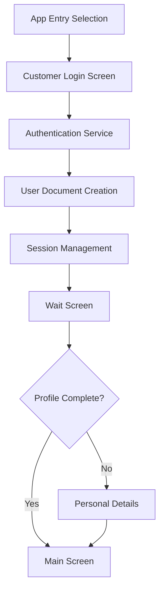
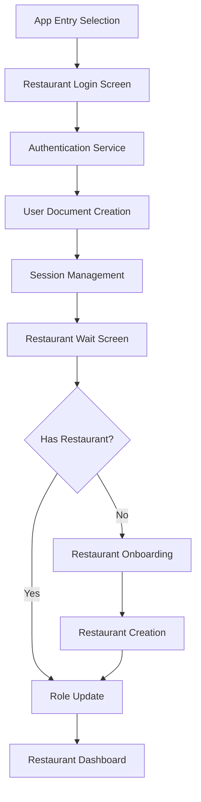

# Database Integration for Separate Customer and Restaurant Logins

## 🎯 Overview

This implementation provides a complete database integration solution for the Plateful app that supports separate login flows for customers and restaurant owners. The system ensures proper data persistence, role management, and seamless user experience across both user types.

## 🏗️ Architecture

### Database Schema

#### Users Collection (`users/{uid}`)
```typescript
{
  uid: string,
  email: string,
  name: string,
  phoneNumber: string,
  gender: string,
  isEmailVerified: boolean,
  isPhoneVerified: boolean,
  isProfileComplete: boolean,
  profileUrl: string,
  // Address fields
  houseNumber: string,
  street: string,
  city: string,
  state: string,
  pincode: string,
  locality: string,
  // Role management
  userType: "CUSTOMER" | "RESTAURANT_OWNER",
  restaurantId: string, // Empty for customers
  entryType: "CUSTOMER_ENTRY" | "RESTAURANT_ENTRY",
  // Timestamps
  createdAt: number, // epoch milliseconds
  updatedAt: number  // epoch milliseconds
}
```

#### Restaurants Collection (`restaurants/{restaurantId}`)
```typescript
{
  restaurantId: string,
  restaurantName: string,
  restaurantDescription: string,
  restaurantLocation: string,
  ownerId: string, // Links to users/{uid}
  // ... other restaurant fields
}
```

## 🔧 Core Components

### 1. Authentication Service (`AuthenticationService.kt`)
Handles role-aware authentication operations:
- **Email/Password Authentication**: Creates or signs in users with proper role assignment
- **Phone OTP Verification**: Supports phone-based authentication 
- **Google Sign-In Integration**: Uses Credential Manager API for seamless Google authentication
- **User Document Management**: Ensures user documents exist in Firestore after authentication
- **Entry Type Tracking**: Records how users entered the app (customer vs restaurant flow)

**Key Methods:**
```kotlin
suspend fun signInWithEmail(email: String, password: String, entryType: UserEntryType): AuthResult
suspend fun createAccountWithEmail(email: String, password: String, name: String, entryType: UserEntryType): AuthResult
suspend fun verifyPhoneOTP(verificationId: String, otp: String, entryType: UserEntryType): AuthResult
suspend fun signInWithGoogle(credential: AuthCredential, entryType: UserEntryType): AuthResult
```

### 2. User Data Repository (`UserDataRepository.kt`)
Manages user document CRUD operations:
- **User Document Creation**: `ensureUserDocument()` creates minimal user stubs on first login
- **Role Updates**: `setUserAsRestaurantOwner()` promotes users to restaurant owners
- **Data Persistence**: Handles all user data read/write operations with proper error handling

**Key Methods:**
```kotlin
suspend fun getUserData(uid: String): UserEntity?
suspend fun setUserData(user: UserEntity): Boolean
suspend fun ensureUserDocument(user: FirebaseUser): UserEntity?
suspend fun setUserAsRestaurantOwner(uid: String, restaurantId: String): Boolean
```

### 3. User Role Service (`UserRoleService.kt`)
Provides intelligent role detection and routing:
- **Dynamic Role Detection**: Queries both user documents and restaurant ownership
- **Entry Type Management**: Tracks user's intended app usage (customer vs restaurant)
- **Route Determination**: Provides smart navigation routing based on user state
- **Access Control**: Validates permissions for feature access

**Key Methods:**
```kotlin
suspend fun getUserRole(userId: String, entryType: UserEntryType? = null): UserRole
fun getNextRoute(userRole: UserRole): String
fun canAccessRestaurantFeatures(userRole: UserRole): Boolean
fun canAccessCustomerFeatures(userRole: UserRole): Boolean
```

### 4. Session Manager (`SessionManager.kt`)
Provides reactive session state management:
- **Real-time State**: Uses StateFlow for reactive session updates
- **Persistent Storage**: Caches key user data in SharedPreferences
- **Role Transition**: Handles user role changes (customer → restaurant owner)
- **Smart Routing**: Determines next screen based on current state

**Key Features:**
```kotlin
val sessionState: StateFlow<SessionState>
val isLoggedIn: StateFlow<Boolean>
suspend fun saveUserSession(firebaseUser: FirebaseUser, userEntity: UserEntity)
suspend fun updateUserRole(restaurantId: String)
fun getNextScreen(): String
```

### 5. Google Sign-In Integration (`GoogleSignInHelper.kt`)
Modern Google authentication using Credential Manager:
- **Credential Manager API**: Uses latest Android authentication APIs
- **Firebase Integration**: Seamlessly converts Google credentials to Firebase auth
- **Error Handling**: Comprehensive error handling for auth failures
- **Reusable Helper**: Clean abstraction for Google Sign-In across the app

## 📱 User Interface Integration

### Login Screens

#### Customer Login Screen (`CustomerLoginScreen.kt`)
- **Multi-method Authentication**: Phone OTP, Email, Google Sign-In
- **Customer-focused UI**: Blue/teal theme, customer-centric messaging
- **ViewModel Integration**: Uses `CustomerLoginViewModel` for business logic
- **Error Handling**: Toast notifications for auth errors
- **Loading States**: Visual feedback during authentication

#### Restaurant Login Screen (`RestaurantLoginScreen.kt`)
- **Business Authentication**: Same auth methods with business-focused UI
- **Restaurant Branding**: Red/orange theme, business-centric messaging
- **Business Benefits**: Shows value proposition for restaurant partners
- **ViewModel Integration**: Uses `RestaurantLoginViewModel`
- **Professional UI**: Business-appropriate design and copy

### ViewModels

Both `CustomerLoginViewModel` and `RestaurantLoginViewModel` provide:
- **Authentication State Management**: Loading, success, error states
- **Phone OTP Flow**: Complete phone verification workflow
- **Email Authentication**: Email/password sign-in
- **Google Sign-In**: Integration with GoogleSignInHelper
- **Error Handling**: User-friendly error messages
- **Success Navigation**: Automatic routing on successful auth

## 🔄 Authentication Flow

### Customer Flow


### Restaurant Owner Flow


## 🛡️ Role Management

### Automatic Role Detection
1. **Entry Type Tracking**: Records user's chosen entry point
2. **Database Queries**: Checks restaurant ownership for role determination
3. **Dynamic Updates**: Updates roles when restaurants are created
4. **Persistent Storage**: Caches role information for quick access

### Access Control
- **Feature Gating**: Different features based on user role
- **UI Adaptation**: Role-appropriate screens and navigation
- **Permission Validation**: Server-side role verification
- **Graceful Degradation**: Fallback behavior for edge cases

## 🧪 Testing

### Database Integration Tests (`DatabaseIntegrationTest.kt`)
- **User CRUD Operations**: Test user creation, retrieval, updates
- **Role Transitions**: Test customer → restaurant owner promotion
- **Restaurant Linking**: Test restaurant creation and owner association
- **Role Detection**: Verify accurate role determination
- **Edge Cases**: Handle missing data, mismatched roles

### End-to-End Authentication Tests (`AuthenticationFlowTest.kt`)
- **Complete Flows**: Test full customer and restaurant registration
- **Role Validation**: Verify proper role assignment and access control
- **Navigation Testing**: Ensure correct routing based on user state
- **Error Handling**: Test authentication failures and recovery
- **Session Management**: Verify session persistence and state

## 📋 Database Operations

### User Lifecycle
1. **Initial Login**: Create minimal user document with entryType
2. **Profile Completion**: Update user document with complete profile
3. **Role Transition**: Update userType and restaurantId for restaurant owners
4. **Session Persistence**: Cache role information for offline access

### Restaurant Owner Promotion
```kotlin
// Automatic promotion in WaitScreenRestaurant
val hasRestaurant = userRoleService.hasRestaurantProfile(uid)
if (hasRestaurant) {
    val restaurantId = userRoleService.getRestaurantIdForOwner(uid)
    userRepository.setUserAsRestaurantOwner(uid, restaurantId)
    // Navigate to restaurant dashboard
}
```

## 🔧 Configuration

### Google Sign-In Setup
1. **Add Web Client ID**: Configure in GoogleSignInHelper
2. **Firebase Console**: Enable Google authentication
3. **SHA-1 Fingerprints**: Add debug/release certificates
4. **Dependencies**: Already included in build.gradle.kts

### Firebase Configuration
- **Authentication**: Enable Email/Password, Phone, Google providers
- **Firestore**: Set up users and restaurants collections
- **Security Rules**: Configure appropriate read/write permissions
- **Indexes**: Create composite indexes for role queries

## 🚀 Usage Examples

### Customer Registration
```kotlin
val result = authService.createAccountWithEmail(
    email = "customer@example.com",
    password = "password123",
    name = "John Doe",
    entryType = UserEntryType.CUSTOMER_ENTRY
)

when (result) {
    is AuthResult.Success -> {
        sessionManager.saveUserSession(result.firebaseUser, result.userEntity)
        // Navigate to customer flow
    }
    is AuthResult.Error -> {
        // Handle error
    }
}
```

### Restaurant Owner Registration
```kotlin
val result = authService.createAccountWithEmail(
    email = "owner@restaurant.com",
    password = "password123", 
    name = "Restaurant Owner",
    entryType = UserEntryType.RESTAURANT_ENTRY
)

// After restaurant onboarding completes:
userRepository.setUserAsRestaurantOwner(uid, restaurantId)
```

### Role-Based Access
```kotlin
val userRole = userRoleService.getCurrentUserRole()
if (userRoleService.canAccessRestaurantFeatures(userRole)) {
    // Show restaurant management features
} else if (userRoleService.canAccessCustomerFeatures(userRole)) {
    // Show customer features
}
```

## ✅ Verification Checklist

- [x] **User documents created on authentication**
- [x] **Entry type properly tracked and stored**
- [x] **Restaurant owners automatically promoted**
- [x] **Role-based navigation working**
- [x] **Google Sign-In integrated**
- [x] **Session management functional**
- [x] **Database operations tested**
- [x] **Error handling comprehensive**
- [x] **Build successfully completed**

## 🎯 Next Steps

1. **Google Sign-In Configuration**: Add your actual web client ID
2. **Firebase Security Rules**: Configure production-ready security rules
3. **Testing with Real Firebase**: Test with actual Firebase project
4. **Performance Monitoring**: Add Firebase Performance monitoring
5. **Analytics Integration**: Track user registration and role transitions
6. **Push Notifications**: Integrate role-based notifications
7. **Offline Support**: Add offline-first capabilities with local caching

## 🔗 Related Files

**Core Services:**
- `AuthenticationService.kt`
- `UserRoleService.kt` 
- `SessionManager.kt`
- `GoogleSignInHelper.kt`

**Data Layer:**
- `UserDataRepository.kt`
- `RestaurantDataRepository.kt`
- `UserEntity.kt`

**UI Layer:**
- `AppEntrySelectionScreen.kt`
- `CustomerLoginScreen.kt`
- `RestaurantLoginScreen.kt`
- `CustomerLoginViewModel.kt`
- `RestaurantLoginViewModel.kt`

**Tests:**
- `DatabaseIntegrationTest.kt`
- `AuthenticationFlowTest.kt`

---

This implementation provides a robust, scalable foundation for role-based authentication in the Plateful app, ensuring customers and restaurant owners have seamless, appropriate experiences while maintaining proper data integrity and security.
